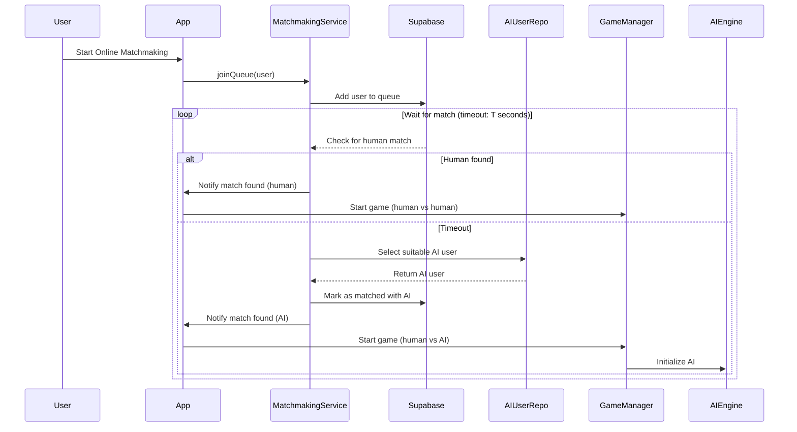
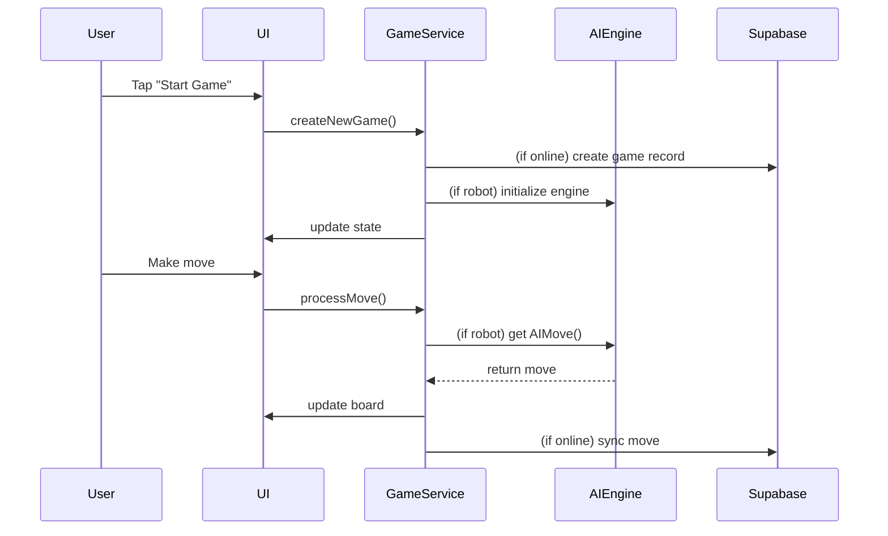

# Chinese Chess (Xiangqi) App – Architecture & Optimization Plan

## 1. High-Level Architecture Overview

```mermaid
graph TD
    A[Flutter App (UI/Logic)]
    B[Supabase Backend]
    C[AI Engine Plugins]
    D[Platform Plugins]
    E[Assets (Images/Sounds)]
    F[Tests & Docs]

    subgraph App Structure
        A1[lib/screens/ (UI)]
        A2[lib/models/ (Data/State)]
        A3[lib/services/ (Business Logic)]
        A4[lib/repositories/ (Data Access)]
        A5[lib/components/ (Widgets)]
        A6[lib/widgets/ (UI Widgets)]
        A7[lib/config/ (Config)]
        A8[lib/l10n/ (Localization)]
    end

    subgraph Plugins
        C1[plugins/engine/]
        C2[plugins/engine_android/]
        C3[plugins/engine_darwin/]
        C4[plugins/engine_interface/]
    end

    A --> A1
    A --> A2
    A --> A3
    A --> A4
    A --> A5
    A --> A6
    A --> A7
    A --> A8
    A --> B
    A --> C
    A --> D
    A --> E
    A --> F
    C --> C1
    C --> C2
    C --> C3
    C --> C4
```

### Key Modules

- **UI/Screens (`lib/screens/`, `lib/widgets/`, `lib/components/`)**: Handles all user interface, navigation, and user interaction.
- **Models (`lib/models/`)**: Data structures for game state, user, timer, etc.
- **Services (`lib/services/`)**: Business logic, game management, matchmaking, authentication, etc.
- **Repositories (`lib/repositories/`)**: Data access layer, interacts with Supabase and local storage.
- **Plugins (`plugins/`)**: Platform-specific and AI engine integration.
- **Assets (`assets/`)**: Images, sounds, and other resources.
- **Localization (`lib/l10n/`)**: Multi-language support.
- **Tests (`test/`, `integration_test/`)**: Unit and integration tests.
- **Docs (`docs/`)**: System and feature documentation.

---

## 2. Online Multiplayer with AI Fallback – Architecture

### Overview

The matchmaking system attempts to pair a user with another human. If no match is found within a configurable timeout, the system falls back to pairing the user with an AI "user" (bot). This ensures a fast and engaging experience even during low user base periods.

### Flow Diagram



### Key Components

- **Matchmaking Queue**: Stores users waiting for a match.
- **Timeout Logic**: If no human match is found within T seconds, fallback to AI.
- **AI User Repository**: Maintains a pool of AI user records (e.g., with `@aitest.com` email).
- **GameManager**: Initializes the game with the correct drivers (human or AI).
- **Supabase**: Backend for queue, user, and game state management.

### Implementation Details

- **AI User Representation**: AI users are stored in the users table with a special marker (e.g., email domain or flag).
- **Queue Matching**: 
  - On join, the user is added to the queue.
  - The system checks for a human match within a set timeout.
  - If not found, it selects an AI user (with similar Elo, etc.) and marks the queue as matched with AI.
- **Game Initialization**:
  - If matched with AI, the game is started with the AI as the opponent.
  - The frontend/game manager initializes the AI engine for the bot's moves.
- **User Experience**:
  - The transition from searching to playing is seamless, regardless of opponent type.
  - Optionally, the UI can indicate if the opponent is a bot.

---

## 3. Existing Performance Optimizations

- **Timer Updates**: Reduced frequency and smarter notifications to avoid unnecessary UI rebuilds.
- **RepaintBoundary**: Isolates repaints for chessboard, pieces, and timers.
- **Animation**: Smoother, less resource-intensive animations.
- **Debug Print Removal**: Replaced with proper logging to reduce main thread work.
- **Performance Tests**: Automated tests to verify optimizations.

---

## 4. Optimization Suggestions

### a. State Management
- **Adopt Riverpod or Bloc**: For more scalable, testable, and granular state management, especially as the app grows.
- **Minimize ChangeNotifier Scope**: Use more fine-grained providers to avoid unnecessary widget rebuilds.

### b. Heavy Computation
- **Move AI/Engine to Isolates**: Offload AI move calculations to Dart isolates to keep the UI thread responsive.
- **Background Processing**: Use compute() or custom isolates for any heavy logic (e.g., ELO calculation, move validation).

### c. Asset & Resource Management
- **Lazy Load Images/Sounds**: Only load assets when needed, especially for large boards or piece sets.
- **Cache Frequently Used Assets**: Use precacheImage and similar techniques.

### d. Networking & Backend
- **Batch Supabase Calls**: Minimize round-trips by batching updates or using real-time subscriptions for game state.
- **Error Handling & Retry**: Implement robust error handling for network failures.

### e. UI/UX
- **Profile in Release Mode**: Always test performance in release builds.
- **Monitor Frame Rates**: Use Flutter DevTools to monitor and optimize frame rendering.
- **Optimize ListViews/Grids**: Use const constructors and itemBuilder patterns.

### f. Testing & Monitoring
- **Expand Performance Tests**: Cover more scenarios, including multiplayer and AI games.
- **Automate Regression Checks**: Ensure optimizations don’t regress over time.

---

## 5. Example Data Flow (Game Start to Move)



---

## 6. Summary Table

| Area                | Current Approach                | Optimization Suggestion                |
|---------------------|--------------------------------|----------------------------------------|
| State Management    | Provider/ChangeNotifier        | Riverpod/Bloc for fine-grained control |
| AI/Heavy Logic      | Main thread                    | Dart isolates for AI/logic             |
| Asset Loading       | Eager load                     | Lazy load/cache                        |
| Networking          | Direct Supabase calls          | Batch/real-time, robust error handling |
| UI Performance      | RepaintBoundary, less prints   | Profile in release, optimize lists     |
| Testing             | Performance test suite         | Expand coverage, automate regression   |

---

## 7. Online Matchmaking with AI Fallback – Key Points

- **Configurable Timeout**: Set a reasonable wait time (e.g., 10–30 seconds) before falling back to AI.
- **AI User Pool**: Maintain a diverse set of AI users with varying Elo and profiles for realistic matching.
- **Seamless Integration**: The user experience should not be interrupted when switching from human to AI opponent.
- **Backend Coordination**: Ensure Supabase logic (RPC/functions) supports both human and AI matching.
- **Extensibility**: The architecture supports future enhancements, such as dynamic AI difficulty or event-based matchmaking.

---