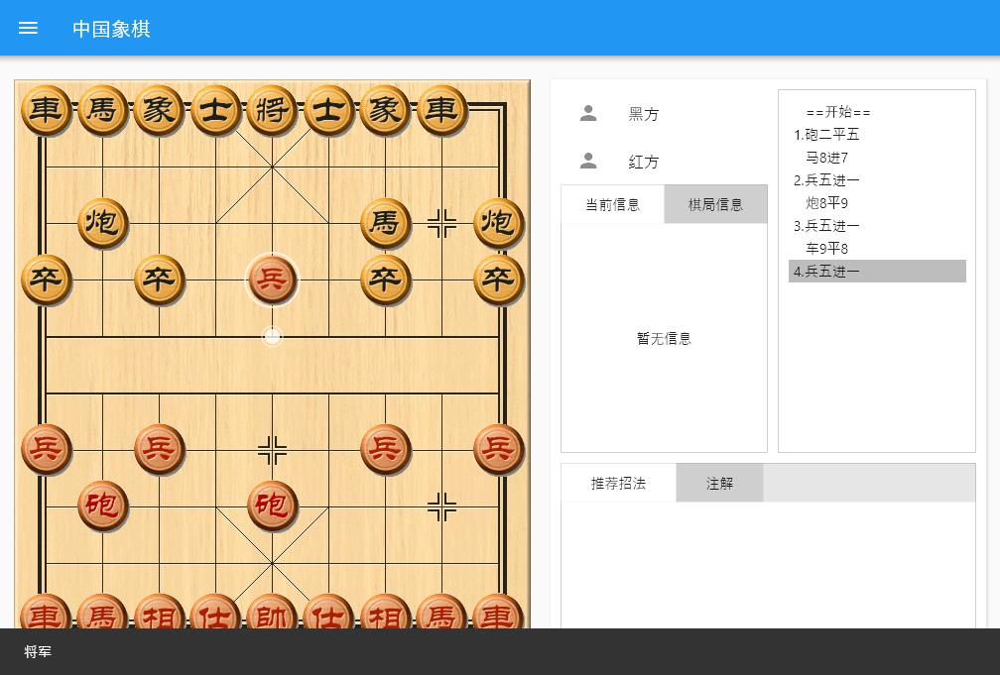
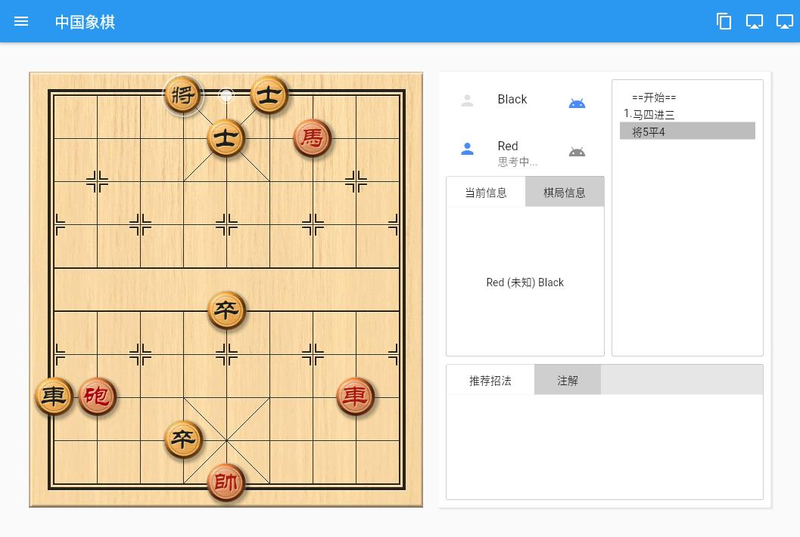
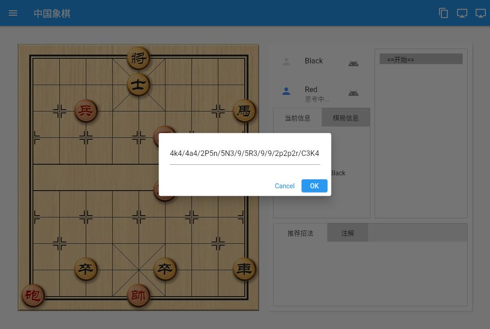
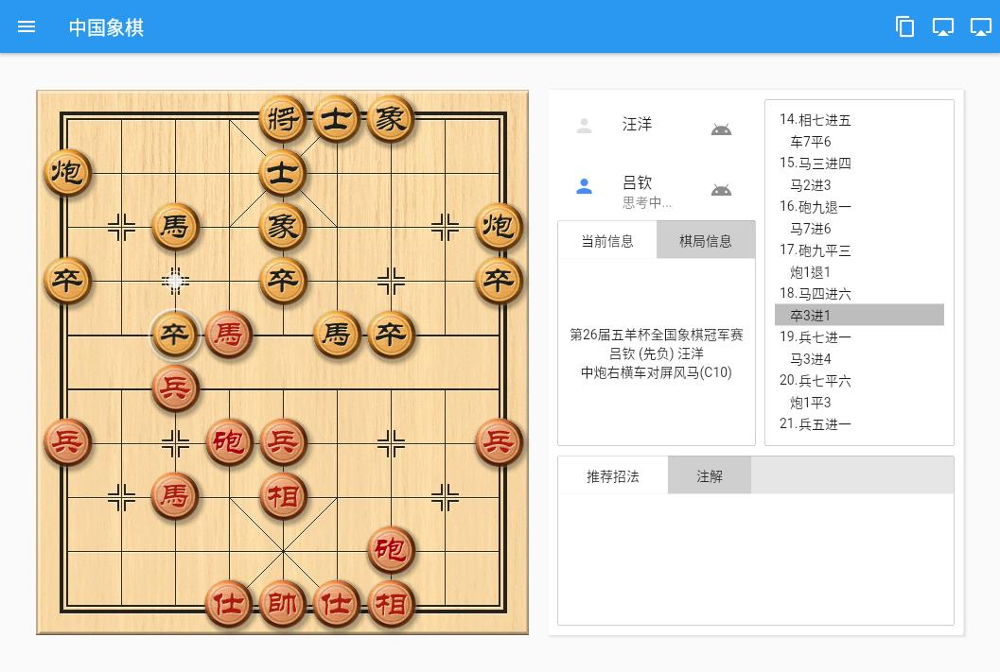
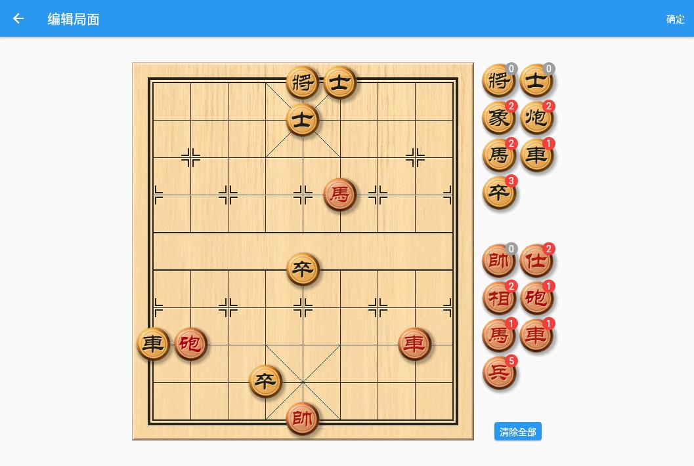
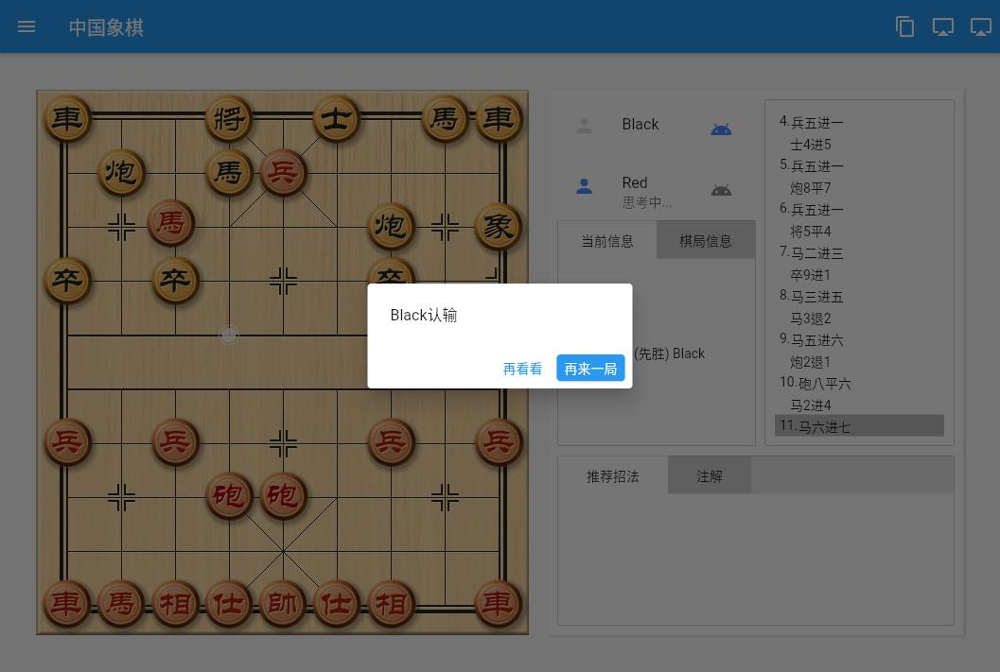

# Chinese Chess (Xiangqi)

A modern implementation of the traditional Chinese Chess (Xiangqi) game built with Flutter.

*** Important Note: This project is for learning and research purposes only. The images and sound resources are from "Chinese Chess Wizard" (象棋小巫师), and the built-in engine is translated from xqlite (JS). Please do not use these resources for commercial projects. ***

## Features

- [x] Complete game rules processing including move hints, check alerts, and win/loss detection
- [x] Customizable board and piece skins
- [x] Support for PGN format loading and FEN format importing
- [x] PGN format export and FEN position copying
- [ ] Automatic game replay
- [x] Multi-language support (English, Chinese, Vietnamese)
- [x] Sound effects
- [x] Game information display
- [x] Position editing
- [x] AI opponent (built-in engine based on Chinese Chess Wizard)
- [ ] Time control
- [ ] Online play

## Platforms
- [x] Android
- [x] iOS

## Known Issues

* [In Progress] The AI uses a simple move generation algorithm
    * Opening book lookup for better opening moves
    * Increased move depth for middle and endgame
    * Improved move weighting algorithm
* [Fixed] Game end detection in certain situations
* Mobile versions use the built-in engine without advanced move analysis


## Preview
The board interface and pieces are from Chinese Chess Wizard resources<br />

|Check|AI Opponent|
|:---:|:---:|
|||
|Paste Position Code|Game Record View|
|||
|Edit Position|Game Result|
|||


## Getting Started

### Prerequisites

- Flutter SDK (3.0.0 or higher)
- Dart SDK (3.0.0 or higher)
- Android Studio / Xcode for deployment

### Installation

1. Clone this repository
```bash
git clone https://github.com/yourusername/chinese_chess.git
```

2. Navigate to the project directory
```bash
cd chinese_chess
```

3. Install dependencies
```bash
flutter pub get
```

4. Run the app
```bash
flutter run
```


## References
* [ECCO](https://www.xqbase.com/ecco/ecco_contents.htm#ecco_a)
* [UCCI](https://www.xqbase.com/protocol/cchess_ucci.htm)
* [Move Notation](https://www.xqbase.com/protocol/cchess_move.htm)
* [FEN Format](https://www.xqbase.com/protocol/cchess_fen.htm)
* [PGN Format](https://www.xqbase.com/protocol/cchess_pgn.htm)

## Changelog

* 2024-04-24: Updated all dependencies to latest versions, added Vietnamese localization, targeted iOS and Android only
* 2021-05-09: Settings page, feature optimization, built-in AI translated from [Chinese Chess Wizard](https://github.com/xqbase/eleeye)
* 2021-05-04: Position editing feature, multiple detail optimizations
* 2021-04-30: Result prompts, game record loading, stalemate detection
* 2021-04-29: Layout reconstruction, move algorithm improvement; skin loading; check and check response detection
* 2021-04-26: Move rules and move animation
* 2021-04-25: Completed interface, moving pieces, capturing pieces

## License

This project is licensed under the MIT License.

## Acknowledgments

- Thanks to the [cchess](https://pub.dev/packages/cchess) package for the game logic
- Special thanks to all contributors who helped with translations and testing